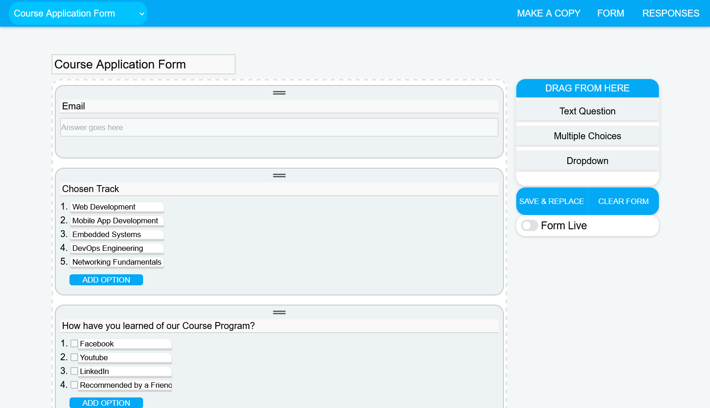
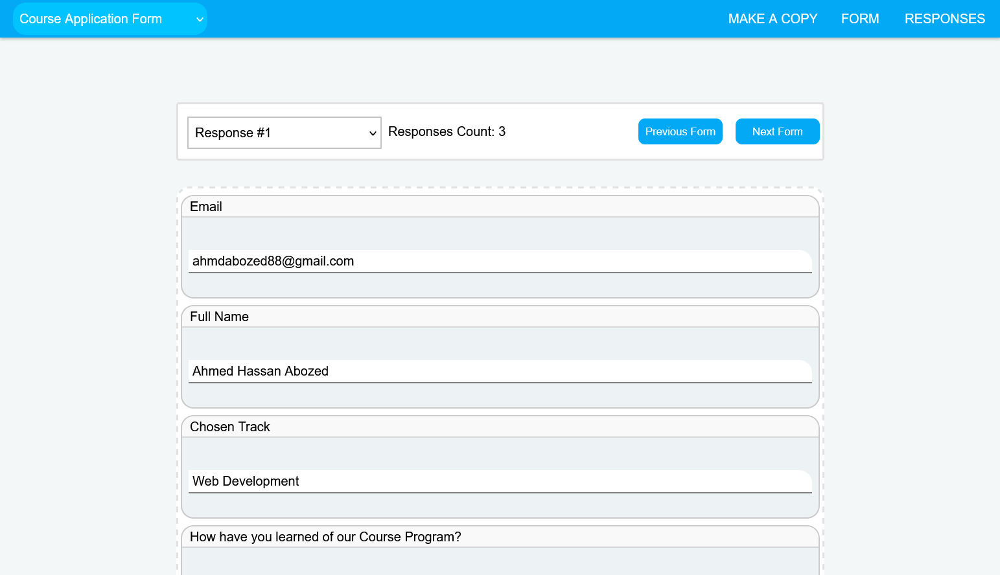

<a id="readme-top"></a>
<br />
<div align="center">
  <a href="https://github.com/github_username/repo_name">
    
  </a>


  <h4 align="center">
    CMS Web App for building and sharing forms.
    <br />

</div>


<details>
  <summary>Table of Contents</summary>
  <ol>
    <li>
      <a href="#about-the-project">About The Project</a>
      <ul>
        <li><a href="#built-with">Built With</a></li>
      </ul>
    </li>
    <li><a href="#installation">Getting Started</a>    </li>
    <li><a href="#usage">Usage</a></li>
    <li><a href="#contact">Contact</a></li>
  </ol>
</details>


## About The Project
A CMS app for building forms using a drag and drop interface, forms are then shared using provided url for users to fill.
Similar in functionality to google forms.

<p align="right">(<a href="#readme-top">back to top</a>)</p>


### Built With

[![Next][Next.js]][Next-url]
[![node.js][Node.js]][Node-url]
[![PostgreSQL]][PostgreSQL-url]
[![Express]][Express-url]


<p align="right">(<a href="#readme-top">back to top</a>)</p>


### Installation
#### Front-end
1. Install NPM packages
   ```sh
   npm install
   ```
2. Run Next dev script
   ```js
   npm run dev
   ```

   
#### Back-end
1. Install NPM packages
   ```sh
   npm install
   ```
2. Create form_builder database using db-migrate
   ```js
   npm run DB
   ```
3. Run Migrations
   ```js
   npm run migrateUp
   ```

4. Build ts and run server
   ```js
   npm run buildStart
   ```

<p align="right">(<a href="#readme-top">back to top</a>)</p>

## Usage
<h3 style="margin-top:0">1. Building Form:</h3>

To build a form simply drag elements from inputs Panel on the right to form area then save form when you're done. Toggle the form live checkbox then share provided url for users to fill the form. Login required to save form. 

<h3 style="margin-top:0.5rem margin-bottom:0">2. Examining responses:</h3>To examine form responses, click RESPONSES at header, choose a response if any from the select input, the filled form will then appear. 




<p align="right">(<a href="#readme-top">back to top</a>)</p>


## Contact

Whatsapp: 01228473230<br>
Linkedin: https://www.linkedin.com/in/ahmed-hassan-abozed-6271b223a/<br>
Project Link: https://github.com/AhmdAbozed/form-builder<br>

<p align="right">(<a href="#readme-top">back to top</a>)</p>


[Next.js]: https://img.shields.io/badge/next.js-000000?style=for-the-badge&logo=nextdotjs&logoColor=white
[Next-url]: https://nextjs.org/
[tailwindcss]: https://img.shields.io/badge/tailwindcss-06B6D4?style=for-the-badge&logo=tailwindcss&logoColor=white
[Node.js]: https://img.shields.io/badge/Node.js-5FA04E?style=for-the-badge&logo=nodedotjs&logoColor=white
[Node-url]: https://nodejs.org/

[PostgreSQL]: https://img.shields.io/badge/PostgreSQL-4169E1?style=for-the-badge&logo=postgresql&logoColor=white
[PostgreSQL-url]: https://www.postgresql.org/


[Express]: https://img.shields.io/badge/express-333333?style=for-the-badge&logo=express&logoColor=white
[Express-url]: https://expressjs.com/